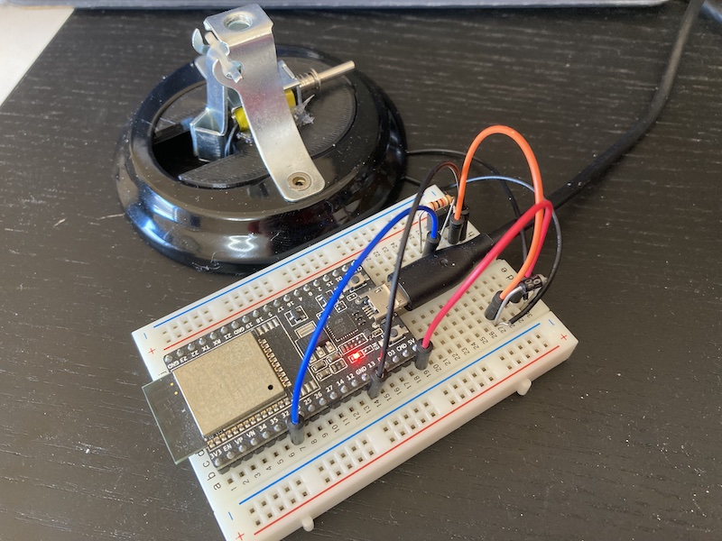
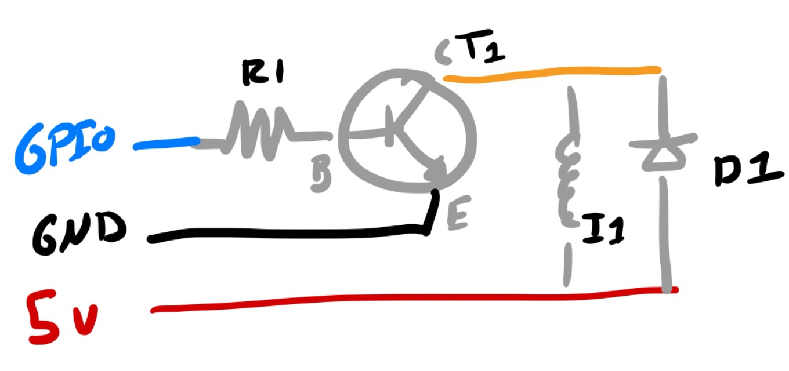

# MQTT Bell Notification

Using an ESP32 DevKit, to connect a Reception Bell to MQTT for notifications.

## Parts List

- [Tabletop Reception Bell](https://www.amazon.co.jp/-/en/gp/product/B08LTJP3NH/)
- [ESP32-DevKitC V4](https://docs.espressif.com/projects/esp-idf/en/latest/esp32/hw-reference/esp32/get-started-devkitc.html)
- I1 - [uxcell Push/Pull Solenoid 4.5V](https://www.amazon.co.jp/-/en/gp/product/B013DR655A/)
- D1 - [1N4002](https://www.marutsu.co.jp/contents/shop/marutsu/datasheet/1n4001.pdf) diode
- T1 - [2SD1164-AZ](https://www.renesas.com/jp/ja/document/dst/2sd1164-z-data-sheet) transistor

## Reference

- https://aaronparecki.com/2017/11/13/5/kickstarter-desk-bell
- https://www.jeffgeerling.com/blog/2021/raspberry-pi-iot-notification-bell
